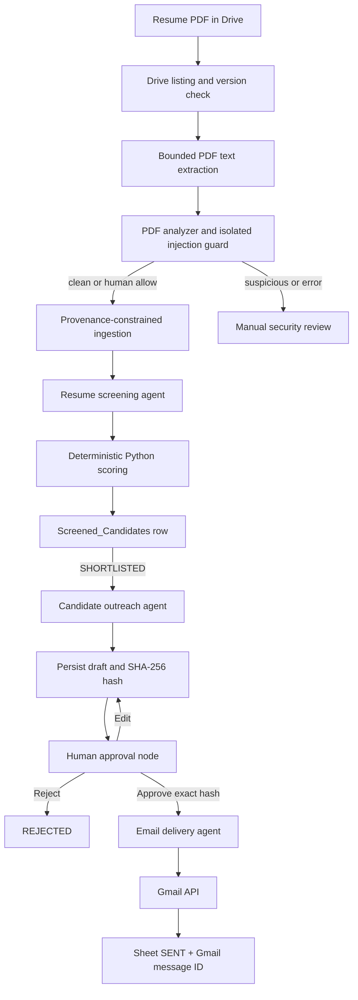

# End-to-end hiring workflow and long-pending approvals

This document follows one candidate from a PDF in Google Drive to a screened
spreadsheet row and, when shortlisted, to a human-approved outreach email.
It describes the implementation as it exists today, including what survives a
10–15 day HR delay and what requires manual recovery.

## 1. System overview



There are two independent Google identities:

- The service account in `keys.json` reads Drive and writes the screening
  spreadsheet.
- The OAuth-authorized Gmail user sends outreach. It cannot read Drive or
  inherit the service account's permissions.

## 2. Starting the system reproducibly

From a fresh terminal:

```bash
cd /Users/apurv_/Downloads/vibes/agents
python3 -m venv .venv
source .venv/bin/activate
python3 -m pip install -r requirements.txt
python main.py
```

The existing `.env` must contain:

```dotenv
GEMINI_API_KEY=...
GEMINI_MODEL=gemma-4-31b-it
RESUME_FOLDER_ID=...
SHEET_ID=...

CLIENT_ID=...
CLIENT_SECRET=...
AUTH_URI=https://accounts.google.com/o/oauth2/auth
TOKEN_URI=https://oauth2.googleapis.com/token
REDIRECT_URIS=http://localhost

COMPANY_NAME=...
SENDER_DISPLAY_NAME=...
SENDER_ROLE=...
REPLY_TO_EMAIL=...
```

Authorize Gmail once:

```text
/authorize-email
```

Then use:

```text
/screen-resumes
/outreach-status
/outreach-shortlisted
```

## 3. Resume discovery and version handling

`/screen-resumes` creates a run ID and authenticates the service account with:

- Drive read-only scope
- Sheets read/write scope

The Drive query returns only non-trashed PDFs whose direct parent is
`RESUME_FOLDER_ID`. Subfolders and non-PDF documents are not traversed.

For each Drive file the system reads:

- Drive file ID
- filename
- MIME type
- size
- modified time
- checksum when available
- download capability

The stable identity is the Drive file ID. The system compares its modified
time with the existing `Screened_Candidates` row:

- Same ID and modified time with completed/review status: skip.
- New ID: process and append a row.
- Existing ID with a new modified time: process and update columns A:T.
- Previous processing error: retry even when the modified time is unchanged.

Outreach columns U:AC are deliberately outside the screening update range, so
rescoring cannot erase approval or delivery state.

## 4. PDF extraction

Each worker creates its own Google API transport because those clients are not
shared safely between threads. At most three resumes are processed in
parallel.

The PDF boundary:

- maximum 15 MB
- maximum 30 pages
- maximum 40,000 extracted characters
- temporary file deleted after success or failure

Encrypted, corrupt, scanned, or nearly textless PDFs become
`REVIEW_REQUIRED`. They are not silently scored as weak resumes.

## 5. Ingestion and privacy separation

Before ingestion, PDF spans are normalized and inspected for hidden or
instruction-like content. An isolated tool-free guard provides another signal.
Suspicious/error cases stop at `/resume-security-review`; they are neither
scored nor eligible for outreach. See
[PROMPT_INJECTION_SECURITY.md](PROMPT_INJECTION_SECURITY.md).

The resume ingestion agent reads extracted text and produces:

- candidate name
- email
- phone
- estimated relevant experience
- job-related evidence

Name/contact information is retained for recruiter use but is separated from
the evidence sent to the screening agent. Photo, age, gender, marital status,
address, nationality, religion, disability, and similar protected or
irrelevant characteristics are excluded from scoring evidence.

The raw PDF text is not written to the Sheet, terminal, screening audit log, or
outreach audit log.

## 6. Screening and deterministic score

The screening agent receives:

- the Full-Stack AI Engineer job description
- editable criteria from the `Criteria` tab
- anonymized professional evidence

It returns 0–5 criterion scores, supporting evidence, strengths, gaps, and a
summary. It does not control the final total.

Python calculates:

```text
criterion contribution =
  score / 5 × criterion weight × 100 / total rubric weight

total score = sum of contributions
```

Experience is overridden deterministically:

- less than 1 year → 0/5
- 1–1.99 years → 2/5
- 2–2.99 years → 3/5
- 3–4.99 years → 4/5
- 5+ years → 5/5

The default threshold is 70:

- total ≥ 70 → `SHORTLISTED`
- total < 70 → `NOT_SHORTLISTED`

Every successfully parsed resume receives a Sheet row, not only shortlisted
candidates.

## 7. Spreadsheet as the operational index

`Criteria` stores the editable job description, threshold, rubric weights,
guidance, and notes.

`Screened_Candidates` stores three groups of data:

1. Drive/version and candidate identity
2. Screening decision, evidence, rubric version, and processing state
3. Outreach draft, approval, delivery, and error state

The Sheet is the recruiter-facing index. Full outreach bodies live only in
owner-protected local draft files.

## 8. Outreach candidate selection

`/outreach-shortlisted` selects only rows where:

- screening status is `SHORTLISTED`
- candidate email is non-empty
- outreach status is not `SENT`, `SENDING`, or `UNKNOWN`
- a prior `REJECTED` row is included only with `--resume`

The command does not rescore resumes.

## 9. Draft generation

The candidate outreach agent has no Gmail tool. It receives the candidate's
name, professional summary, and strengths and produces:

- fixed interview invitation
- fixed request to reply with availability
- configured company signature
- optionally one short evidence-grounded personalization sentence

It cannot mention numeric score, ranking, protected characteristics, inferred
facts, or other candidates.

The draft is saved to:

```text
data/outreach_drafts/<draft-id>.json
```

The directory is mode `0700`; draft files are mode `0600`.

The SHA-256 hash covers draft ID, Sheet row, sender, recipient, reply-to,
subject, text body, and HTML body. Changing any of those fields changes the
hash.

The Sheet becomes `PENDING_APPROVAL` and stores the draft ID/hash/subject.

## 10. Human approval

The CLI displays:

```text
Approval ID
From
To
Reply-To
Subject
Complete plain-text body
```

The HR user chooses:

- Approve: persist the approval ID, exact hash, and timestamp.
- Edit: replace subject/body, regenerate HTML/hash, clear the old approval,
  and display a new approval prompt.
- Reject: persist `REJECTED`; no Gmail call occurs.

Approval authorizes one exact immutable message. It is not permission to send a
later edited version.

## 11. Delivery

Only the email delivery agent can reach `send_approved_email`.

Before Gmail is called, the runtime reloads the draft and checks:

1. Status is `APPROVED`.
2. Approval ID matches.
3. Approved hash equals the current recomputed hash.
4. Recipient is syntactically valid.
5. No Gmail message ID already exists.
6. OAuth sender equals the draft sender.

It then marks the local draft `SENDING`, builds plain-text and HTML MIME parts,
base64URL-encodes the message, and invokes Gmail exactly once with library
retries disabled.

Success stores:

- `SENT`
- sent timestamp
- Gmail message ID

A definite pre-send or 4xx failure becomes `FAILED`. A network interruption or
5xx becomes `UNKNOWN`, because Gmail might have accepted the message before
the response was lost. `UNKNOWN` is never retried automatically.

## 12. What happens when HR waits 10–15 days?

### What is durable

There is no application-level expiry on pending drafts. After 10–15 days these
remain available:

- candidate Sheet row
- `PENDING_APPROVAL` or `EDITED_PENDING_APPROVAL`
- draft ID
- draft hash
- complete local draft file
- screening score and evidence

Resume reruns preserve those outreach columns.

### If the original terminal process is still running

The process is blocked at `input()` waiting for HR. When HR finally types:

- Approve: the exact draft is approved and delivery is attempted immediately.
- Edit: the hash changes and a new approval prompt appears.
- Reject: the row becomes `REJECTED` and nothing is sent.

Keeping a terminal process open for 10–15 days is possible but not operationally
reliable; sleep, reboot, terminal closure, or deployment restart ends it.

### If the process was closed or restarted

Start the app and run:

```text
/outreach-status
/outreach-shortlisted
```

The runtime sees the Sheet's pending status, reloads the existing local draft,
and displays it again. It creates a new approval-request ID because the
original interactive approval object existed only in the old process. The
draft body and hash remain unchanged.

Approve then attempts immediate delivery. Reject persists `REJECTED`. Edit
creates a new hash and requests approval again.

### OAuth Testing-mode expiry

Google documents that authorizations by test users for External apps in
Testing status normally expire after seven days:

https://support.google.com/cloud/answer/15549945

Therefore, after 10–15 days, the stored Gmail refresh token may no longer work.
The durable draft is not lost, but sending cannot proceed until Gmail is
authorized again.

Recommended return sequence:

```text
/email-auth-status
```

If unauthorized:

```text
/authorize-email
```

Then:

```text
/outreach-shortlisted
```

This shows the pending draft and asks for approval.

### Important current limitation

The current implementation does not run a background worker, scheduler, web
approval inbox, or durable message queue. It cannot notice a human decision
while the application is stopped. A human must return to the CLI and run the
outreach command.

If an approval is given and Gmail authentication then fails before the send
request, the candidate becomes `FAILED`. After reauthorization, rerun:

```text
/outreach-shortlisted --resume
```

The system intentionally asks for approval again. It does not reuse a prior
approval after a failed delivery attempt.

Thus the current guarantee is:

> A persisted pending draft can be recovered and reviewed after 10–15 days.
> An approved draft is sent immediately when valid Gmail authorization is
> available.

It does **not** guarantee:

> Approve now and deliver later automatically while the application is
> stopped or Gmail authorization is expired.

### Reject behavior

Rejecting never sends an email. The status remains `REJECTED`, and normal
outreach runs skip it. To deliberately reopen it:

```text
/outreach-shortlisted --resume
```

That produces a fresh approval decision; it does not silently send the
previous rejection.

## 13. Ten-to-fifteen-day operating checklist

When HR returns:

```bash
cd /Users/apurv_/Downloads/vibes/agents
source .venv/bin/activate
python main.py
```

Then:

```text
/email-auth-status
/outreach-status
```

If OAuth expired:

```text
/authorize-email
```

Finally:

```text
/outreach-shortlisted
```

Review every displayed recipient and complete body, then approve, edit, or
reject.

## 14. State and recovery table

| State | Meaning | Normal recovery |
|---|---|---|
| `NOT_PREPARED` | No draft yet | `/outreach-shortlisted` |
| `PENDING_APPROVAL` | Draft saved, waiting for HR | `/outreach-shortlisted` |
| `EDITED_PENDING_APPROVAL` | Edited draft needs new approval | `/outreach-shortlisted` |
| `REJECTED` | HR rejected it | No action, or `--resume` intentionally |
| `APPROVED` | Approved but send did not finish | Rerun; approval is requested again |
| `SENDING` | Send started; result uncertain after interruption | Inspect Gmail manually |
| `SENT` | Gmail returned a message ID | No action; automatically skipped |
| `FAILED` | Known pre-send/4xx failure | Fix cause, rerun, approve again |
| `UNKNOWN` | Gmail might have accepted it | Inspect Sent mail; never auto-retry |

## 15. Production improvement path

For dependable asynchronous 10–15 day approvals, the next version should add:

- durable approval records independent of a running terminal
- approver identity and authentication
- web or chat approval inbox
- approval expiry/reminder policy
- background delivery worker
- transactional outbox or durable queue
- token-health monitoring before approval
- company production OAuth project rather than Testing status
- reconciliation for `SENDING` and `UNKNOWN`

Until those exist, the CLI recovery sequence above is the authoritative
operating procedure.
