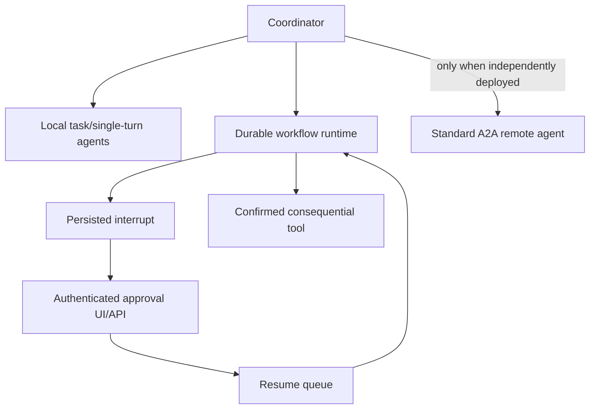

# Google ADK versus this project

This document compares Google Agent Development Kit (ADK) communication,
handoff, Agent2Agent (A2A), workflow, and human-in-the-loop mechanisms with the
framework-free implementation in this repository.

Research was performed against the current official ADK documentation in July
2026. ADK 2.0 features are identified separately from older template-workflow
features because their APIs and guarantees differ.

## 1. Executive summary

Both systems use the same broad design ideas:

- specialized agents with restricted responsibilities
- coordinator-to-specialist delegation
- sequential and parallel execution
- explicit state passed between steps
- human approval before consequential tools
- interruption and later continuation

They differ in abstraction and interoperability:

| Area | Google ADK | This project |
|---|---|---|
| Runtime | Framework runner, sessions, events, invocation context | Ordinary Python loops and dataclasses |
| Local delegation | Built-in coordinator/sub-agent collaboration modes | Coordinator function declarations and `AgentSpec` |
| Handoff | Runtime transfer and return semantics | Explicit `HandoffManager` route and accept/reject |
| Remote agents | Standard A2A servers, Agent Cards, `RemoteA2aAgent` | No network protocol; synchronous local message bus |
| Workflows | Graph, dynamic, collaborative, and template workflows | Custom DAG runtime plus dedicated screening/outreach loops |
| HITL | Graph `RequestInput` and tool confirmation | `ApprovalRequest`, terminal input, draft hash guard |
| Resume | Invocation-ID-based resumability when configured | Reload Sheet/draft and reconstruct a new approval |
| UI/API | ADK web/API server and remote confirmation APIs | Terminal CLI only |
| Transparency | More behavior supplied by framework | Every transition is visible in project Python |

The most important conclusion is:

> `src/protocol.py` is A2A-inspired, but it is not an A2A implementation.

It has useful message IDs, correlation IDs, sender/recipient fields, and typed
messages, but it does not implement Agent Cards, A2A tasks, JSON-RPC/HTTP,
streaming, artifacts, remote authentication, or protocol discovery.

## 2. Google ADK workflow model

ADK supports multiple orchestration architectures:

- graph workflows
- dynamic programmatic workflows
- collaborative agent workflows
- older sequential, parallel, and loop template workflows

ADK graph workflows can mix deterministic nodes and AI-powered agents with
branching. Template agents execute predefined sequential, parallel, or loop
logic without asking an LLM to choose orchestration.

Sources:

- https://adk.dev/workflows/
- https://adk.dev/agents/workflow-agents/

Our `Workflow`, `WorkflowNode`, and `WorkflowRuntime` are closest to ADK graph
workflows:

```text
ADK Workflow graph       <-> src/workflow.py
ADK graph node           <-> WorkflowNode
ADK execution runtime    <-> WorkflowRuntime
ADK RequestInput         <-> ApprovalRequest + HUMAN_APPROVAL node
ADK workflow events      <-> WorkflowRun.events
```

Our graph validator explicitly checks duplicate IDs, missing dependencies,
cycles, unknown agents/tools, size, and depth. The scheduler executes ready
nodes with a three-worker pool and blocks descendants of failed dependencies.

ADK offers more framework integration: sessions, event history, server APIs,
typed node data, runtime inspection, and resumable invocation support.

## 3. Local agent-to-agent communication

### Google ADK approach

ADK 2.0 collaborative workflows place sub-agents under a coordinator and give
each sub-agent an operating mode:

- `chat`: full interaction; agent keeps control until an explicit transfer
- `task`: may clarify; calls `complete_task` and automatically returns
- `single_turn`: no human interaction; returns immediately and supports
  parallel execution

Declaring sub-agents causes ADK to generate delegation tools such as
`request_task_<agent_name>`. Task and single-turn branches use isolated
session branches; parallel peers do not see each other's live events. The
parent receives their collected results when they finish.

Source:

- https://adk.dev/workflows/collaboration/

### Our approach

`src/agents.py` defines an `AgentSpec` for each specialist:

- stable name and description
- specialist system instructions
- low-level tool allowlist
- tool-round and output limits
- allowed handoff destinations
- accepted protocol message types

The coordinator sees generated `ask_<agent>` function declarations. A model
function call becomes a bounded specialist invocation. Independent calls in
one coordinator response run concurrently; dependent calls occupy later
coordinator rounds.

Specialists are stateless and receive a focused task plus bounded context.
They do not share live conversation branches. The coordinator receives
structured result objects.

### Comparison

| Question | ADK collaboration | Our coordinator |
|---|---|---|
| Who selects a specialist? | Coordinator LLM via generated request tools | Coordinator model via generated declarations |
| Context boundary | Invocation/session branch | Fresh model call with bounded text |
| Parallel peers isolated? | Yes for task/single-turn branches | Yes; separate Gemini clients and evidence |
| Automatic return? | Mode-dependent | Always returns a result to coordinator |
| User-facing transfer? | Supported in chat mode | Coordinator remains default speaker |
| Runtime limits | Framework/run configuration | Explicit constants in source |

Our existing resume agents behave most like ADK `single_turn` or `task`
sub-agents, even though the code does not name those modes.

## 4. Handoffs and control transfer

### Google ADK approach

ADK distinguishes invocation context:

- A task agent used as a workflow graph node finishes and advances to the next
  graph node.
- A task agent invoked by an LLM coordinator returns to its originating agent
  through `complete_task`.
- A default chat agent retains control until an explicit
  `transfer_to_agent`.

The runtime knows whether the agent was invoked as a graph node or transferee
and applies the corresponding return behavior.

Source:

- https://adk.dev/workflows/collaboration/

### Our approach

`HandoffManager` accepts:

- source and destination
- task and context summary
- reason
- trace and handoff IDs
- return policy
- current depth

It validates:

- destination is in the source agent's allowlist
- depth is at most three
- total transfers are at most five
- return policy is known
- destination explicitly accepts or rejects

The request is sent through `MessageBus` as `HANDOFF_REQUEST`. The destination
returns `HANDOFF_ACCEPT` or `HANDOFF_REJECT`, correlated with `reply_to`.

### Important semantic difference

Our current handoff is principally a bounded task ownership transfer that
returns a result. The normal policy is `return_to_coordinator`; it does not
fully transfer the public conversation to a new long-lived user-facing agent.

ADK chat-mode transfer is closer to a real conversational handoff. ADK
task-mode behavior is closer to our current implementation.

## 5. Google A2A versus our protocol

### Google ADK and A2A

ADK uses A2A for independent remote agent services. Official guidance says to
prefer local sub-agents for same-process modules and A2A when agents:

- run as standalone services
- belong to another team or organization
- use different languages/frameworks
- require a formal network contract

An A2A agent exposes an Agent Card describing identity, capabilities, input
and output modes, skills, version, and endpoint. ADK can expose an existing
agent as A2A and consume another service using `RemoteA2aAgent`.

The remote adapter translates A2A messages, tasks, status changes, artifacts,
and streaming updates into ADK events. It also supports request/response
interceptors and custom converters.

Sources:

- https://adk.dev/a2a/
- https://adk.dev/a2a/intro/
- https://adk.dev/a2a/quickstart-consuming/
- https://adk.dev/a2a/a2a-extension/

### Our local message protocol

`AgentMessage` contains:

```json
{
  "message_id": "uuid",
  "correlation_id": "uuid",
  "trace_id": "uuid",
  "sender": "agent_name",
  "recipient": "agent_name",
  "type": "handoff_request",
  "payload": {},
  "reply_to": null,
  "timestamp": "UTC"
}
```

`MessageBus`:

- registers local Python handlers
- checks recipient existence
- enforces a 16 KB serialized message limit
- records sent/received events
- calls the recipient synchronously
- validates reply correlation

### Capability gap

| A2A capability | ADK | Our system |
|---|---:|---:|
| Network transport | Yes | No |
| Agent Card discovery | Yes | No |
| Standard task lifecycle | Yes | No |
| Streaming/SSE | Yes | No |
| Artifact updates | Yes | No |
| Cross-language agents | Yes | No |
| Remote authentication | Deployment-dependent | No |
| Message/correlation IDs | Yes | Yes |
| Typed local messages | Yes | Yes |
| Route allowlist | Via configuration/policy | Yes |
| Payload size boundary | Transport/runtime | 16 KB explicit |

Calling our bus “A2A” without the qualifier “inspired” would overstate its
interoperability.

## 6. Google ADK HITL

ADK exposes HITL at two layers.

### Graph human-input nodes

ADK 2.0 graph workflows use `RequestInput`. A node emits a message and optional
payload, execution pauses, and the human reply flows to the resumed node or
its successor. A response schema can describe expected structured input,
although clients still need to supply/validate the correct shape.

Source:

- https://adk.dev/graphs/human-input/

### Tool action confirmation

A `FunctionTool` can set `require_confirmation=True` for yes/no confirmation,
use a conditional confirmation function, or request advanced structured
confirmation through tool context. ADK pauses tool execution until the
confirmation response arrives.

The ADK web UI can render a confirmation dialog. Remote confirmation responses
can be delivered using the ADK server REST API. The documentation currently
labels tool confirmation experimental.

Source:

- https://adk.dev/tools-custom/confirmation/

## 7. Our HITL implementation

The generic DAG runtime uses:

- `ApprovalRequest`
- `ApprovalStatus`
- `HUMAN_APPROVAL` node
- `WAITING_FOR_HUMAN` workflow status
- approve, reject, edit, or expire decisions

The outreach workflow adds a stronger action-specific boundary:

1. Persist the complete draft locally.
2. Hash sender, recipient, subject, bodies, and candidate row.
3. Display the complete message.
4. Store an approval ID and exact hash.
5. Reload the draft inside `send_approved_email`.
6. Recompute and compare the hash.
7. Verify status, recipient, sender, and prior Gmail ID.
8. Send only if every check passes.

An edit changes the hash and clears approval.

This exact-content approval binding is more application-specific than ADK's
general confirmation interface. ADK could implement the same guard inside a
confirmed tool, but it does not automatically provide email-draft hashing.

## 8. Interruption and resume

### Google ADK approach

ADK resumability can track workflow execution and resume a stopped invocation
using its Invocation ID. The app must enable `ResumabilityConfig`. The API
server can restart, load event history, and resume the interrupted workflow.
Custom agents require explicit resume support.

ADK warns that long-running functions, confirmations, and authentication have
special behavior when resumability is enabled.

Source:

- https://adk.dev/runtime/resume/

### Our approach

The generic workflow model can serialize workflow results and approvals, but
the CLI does not reconstruct and resume the identical interrupted invocation.

Outreach recovery instead uses business state:

- Sheet remains `PENDING_APPROVAL`
- draft JSON remains on disk
- `/outreach-shortlisted` reloads the draft
- a new `ApprovalRequest` and approval ID are created
- approve/reject/edit continues from the recovered business state

This is recovery by reconstruction, not invocation resume.

### Ten-to-fifteen-day approval comparison

| Event | ADK resumable workflow | Our outreach workflow |
|---|---|---|
| Process exits while waiting | Resume same Invocation ID if configured/persisted | Reload draft and create new approval ID |
| Approval request identity | Stable interruption/invocation metadata | Recreated after restart |
| Draft/business state | Application/session state | Sheet plus local JSON |
| Human response channel | Client/API/web depending deployment | Terminal input |
| Background delivery | Requires deployed runtime/worker | Not present |
| OAuth expiry | Application must still handle it | Explicit `/authorize-email` recovery |

Our draft durability is useful, but ADK's resumable event model is the stronger
general-purpose foundation for long-lived workflows.

## 9. Failure and duplicate-send behavior

ADK provides event-driven execution and configurable confirmation/resume, but
application code still owns external API idempotency.

Our Gmail boundary deliberately adds:

- `SENDING`, `SENT`, `FAILED`, and `UNKNOWN`
- no automatic retry for ambiguous sends
- Gmail message ID persistence
- blocking of `SENDING`, `SENT`, and `UNKNOWN`
- exact approval-hash validation

This logic would still be required if the project migrated to ADK. A framework
can resume control flow; it cannot prove whether Gmail accepted a request whose
network response was lost.

## 10. Strengths and weaknesses

### Google ADK strengths

- standard agent/session/event abstractions
- built-in local collaboration semantics
- explicit chat/task/single-turn modes
- graph HITL nodes and tool confirmation
- web UI and REST response channels
- Invocation-ID resumability
- A2A interoperability and streaming
- easier distributed deployment

### Google ADK tradeoffs

- more framework concepts and lifecycle behavior to learn
- some ADK 2.0 and confirmation features are new or experimental
- application-specific authorization and idempotency remain custom
- version upgrades can change orchestration APIs
- some behavior is less visible than ordinary local Python

### Our strengths

- small, inspectable framework-free code
- explicit tool and handoff allowlists
- strict graph and payload bounds
- specialist statelessness and context minimization
- exact-content outreach approval
- deterministic screening arithmetic
- careful ambiguous-send handling
- no need to operate agent servers

### Our weaknesses

- no standard remote-agent interoperability
- local synchronous message bus only
- no Agent Cards or A2A task lifecycle
- no streaming agent communication
- no durable approval inbox or remote approver API
- no stable invocation resume after restart
- terminal-only human interaction
- persistence is JSON/Sheets rather than transactional storage

## 11. What we should adopt from ADK

The project does not need an immediate wholesale ADK rewrite. The highest-value
ideas can be adopted incrementally.

### Priority 1: durable interruptions

Persist:

- stable interrupt ID
- workflow run ID
- node ID
- exact approval payload/hash
- created/expiry times
- approver identity
- response
- resume target

Add commands/API methods that resume by interrupt ID instead of reconstructing
a new approval.

### Priority 2: confirmation as tool middleware

Move the generic “approval required” rule into the tool execution boundary,
similar to ADK `require_confirmation`. A consequential tool should declare its
confirmation policy, and the runtime should block it before its Python
function executes.

Keep the email-specific draft-hash validation as a second defense.

### Priority 3: explicit agent modes

Add an `AgentMode` field:

- `chat`
- `task`
- `single_turn`

Use it to define user interaction, automatic return, parallel eligibility, and
context isolation rather than encoding those rules indirectly.

### Priority 4: remote approval channel

Expose pending approvals through an authenticated API or small web UI. The API
should accept stable interrupt ID plus approve/reject/edit payload and then
enqueue a resume operation.

### Priority 5: real A2A only when needed

Keep local agents in process. Implement or adopt A2A only when a specialist
becomes an independently deployed service, is owned by another team, or needs
cross-language interoperability.

At that point use:

- Agent Cards
- standard A2A task/message/artifact structures
- authenticated HTTP/JSON-RPC or supported transport
- streaming status and artifact updates
- request/response interceptors

Do not extend the custom local envelope into an incompatible pseudo-standard.

## 12. Recommended target architecture



This preserves the project's transparency and exact email safeguards while
adding the strongest ADK ideas: stable interruptions, runtime confirmation,
clear agent modes, real resume semantics, and standards-based remote agents.

## 13. Primary sources

- ADK workflow overview: https://adk.dev/workflows/
- Collaborative agent teams: https://adk.dev/workflows/collaboration/
- Template workflow agents: https://adk.dev/agents/workflow-agents/
- Graph human input: https://adk.dev/graphs/human-input/
- Tool action confirmation: https://adk.dev/tools-custom/confirmation/
- Resume stopped agents: https://adk.dev/runtime/resume/
- A2A overview: https://adk.dev/a2a/
- A2A introduction: https://adk.dev/a2a/intro/
- Consuming remote A2A agents: https://adk.dev/a2a/quickstart-consuming/
- A2A reliability extension: https://adk.dev/a2a/a2a-extension/
