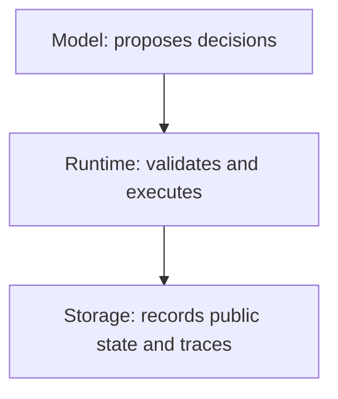
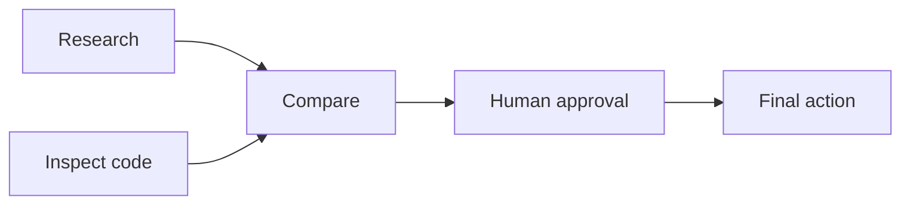
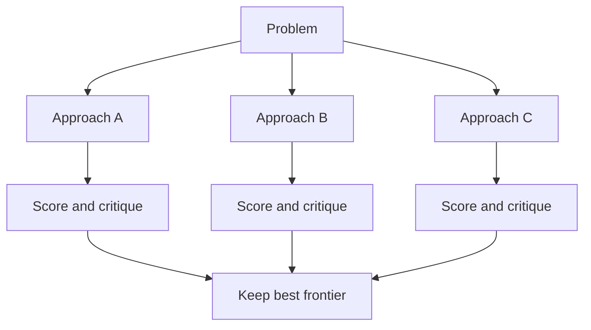
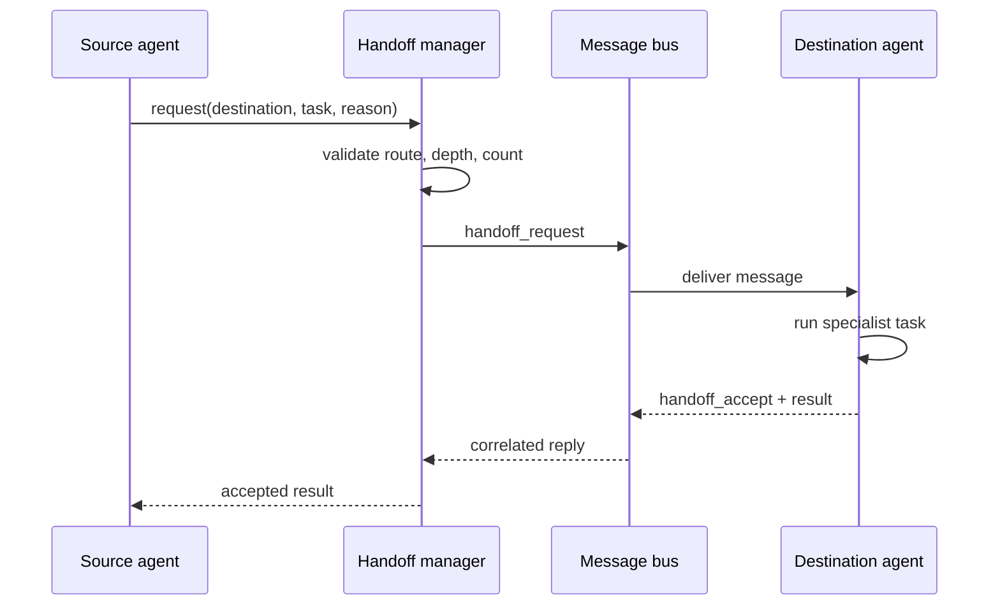

# Beginner guide: how the agent system works

This guide starts at the terminal and follows every important Python object
until the work finishes. No framework hides the control flow.

## 1. The three layers



The model is not the authority. It can request a tool, agent, workflow, or
handoff, but Python checks the request against registries and limits.

- `src/agents.py` defines agent identities and permissions.
- `src/tools.py` maps allowed names to real Python functions.
- `src/runtime.py` runs one specialist.
- `src/agent.py` runs the original coordinator/delegation flow.
- `src/workflow_runtime.py` runs a DAG.
- `src/orchestrator.py` connects DAG nodes to Gemini and existing specialists.

## 2. What a DAG is

A directed acyclic graph is a collection of nodes joined by one-way dependency
edges. “Acyclic” means following dependencies can never return to an earlier
node.



`Research` and `Inspect code` have no dependency on each other, so the runtime
may execute them in parallel. `Compare` waits for both.

## 3. Workflow definition

`Workflow.from_dict()` converts JSON into:

- `Workflow`: identity, goal, overall status, and nodes.
- `WorkflowNode`: ID, type, configuration, and dependencies.
- `NodeResult`: completion status, output, evidence, artifacts, or error.

Supported node types are:

| Type | Purpose |
|---|---|
| `agent` | Run a registered specialist |
| `tool` | Call one explicitly registered Python tool |
| `reasoning_chain` | Build bounded inspectable decision summaries |
| `tree_search` | Generate, score, and prune alternative approaches |
| `human_approval` | Pause until a person approves or rejects |
| `handoff` | Ask another agent to accept active ownership |
| `join` | Gather dependency outputs |

## 4. Validation before execution

`validate_workflow()` runs before the first node. It checks:

1. The goal is not empty.
2. There are 1–20 nodes.
3. Every node ID is unique.
4. Every dependency exists.
5. No node depends on itself.
6. Agent and tool names exist in their registries.
7. Depth does not exceed eight.
8. A depth-first graph walk finds no cycle.

The model cannot bypass these checks by placing instructions inside a task.

## 5. Scheduler internals

`WorkflowRuntime.continue_run()` repeatedly performs this loop:

```text
mark descendants of failed nodes as blocked
find pending nodes whose dependencies completed
turn approval nodes into waiting records
submit other ready nodes to a three-worker thread pool
save each result
repeat until complete, failed, or waiting for a human
```

Only dependency status determines readiness. Completion time does not change
the dependency rules.

Failure travels forward. If `A` fails and `B` depends on `A`, then `B` becomes
`blocked`; it is never executed with missing input.

## 6. Agent nodes

The workflow runtime calls the handler registered for `config.agent`.
`orchestrator.py` converts that call into the existing `run_specialist()` loop:

1. Create a fresh Gemini client.
2. Give the specialist its narrow system prompt.
3. Expose only tools in the specialist allowlist.
4. Receive a structured function call.
5. Look up the function in `TOOL_FUNCTIONS`.
6. Execute it and return the observation.
7. Ask for a concise final specialist answer.
8. Return evidence, artifacts, token use, latency, and status.

Specialists remain stateless. Dependency outputs are serialized into a bounded
context string for the new invocation.

## 7. Chain reasoning node

The name “Chain of Thought” can be misleading. Private model reasoning is not
requested, exposed, or stored. The node instead builds an application-level
decision record:

```json
{
  "summary": "What was considered",
  "evidence": ["Observable fact"],
  "decision": "What happens next",
  "confidence": 0.8,
  "final": false
}
```

The chain has at most eight steps. Each step sees the problem and previous
public summaries. This makes the execution understandable without pretending
that a written explanation is the model's hidden internal computation.

## 8. Tree-of-Thought node

Tree search is useful when more than one plausible plan should be explored.



The implementation:

1. Generates two or three proposals.
2. Gives each proposal a 0–1 score and concise critique.
3. Sorts candidates by score.
4. Keeps only the bounded frontier.
5. Repeats for at most two levels.
6. Marks the highest-scoring final proposal as selected.

This costs more model calls than a chain, so it should be reserved for genuine
search or planning.

## 9. Human-in-the-loop

An approval node produces an `ApprovalRequest` and changes the workflow status
to `waiting_for_human`. The request includes:

- action
- reason
- dependency-output preview
- workflow ID
- node ID
- approval ID

The graph is persisted while paused. The human can approve, reject, edit, or
expire it. Approval completes the node. Rejection fails the node and blocks
its descendants.

In the terminal, `/workflow` displays the action and asks `Approve? [y/N]`.
The default is rejection because silence should not authorize an action.

## 10. Messages between agents

`AgentMessage` is a local A2A-inspired envelope:

```json
{
  "message_id": "unique message",
  "correlation_id": "shared operation",
  "trace_id": "whole execution",
  "sender": "codebase_agent",
  "recipient": "data_science_agent",
  "type": "handoff_request",
  "payload": {},
  "reply_to": null,
  "timestamp": "UTC time"
}
```

`MessageBus` verifies that the recipient is registered and the encoded message
is at most 16 KB. A reply must identify the original message with `reply_to`.
Tool permissions are never carried in the message.

The bus is synchronous and in-process today. The envelope deliberately avoids
transport-specific fields so a later HTTP or queue adapter can preserve the
same contract.

## 11. Delegation versus handoff

Delegation asks a specialist for a result while the coordinator remains in
charge. A handoff asks a destination agent to become the active owner.

The handoff flow is:



Allowed routes live in each `AgentSpec`. The manager permits at most three
handoff levels and five transfers. A destination must explicitly accept or
reject.

## 12. Persistence and observability

- Public chat: `data/sessions/<session-id>.json`
- Turn traces: `data/trajectories.jsonl`
- DAG runs: `data/workflows/<run-id>.json`

A saved DAG contains its definition, node results, approval records, and
workflow events. Specialist, protocol, and handoff events are included in the
top-level run result.

Important IDs have different scopes:

- `workflow_id`: logical graph
- `run_id`: one execution attempt
- `trace_id`: correlated model/agent activity
- `node_id`: stable graph node
- `message_id`: one protocol message
- `correlation_id`: one request/reply conversation

## 13. Running the example

Set `GEMINI_API_KEY` in `.env`, start the application, then enter:

```text
/workflow examples/learning_workflow.json
```

The example:

1. Asks the codebase agent to inspect the implementation.
2. Runs a bounded tree search.
3. Pauses for human approval.
4. Demonstrates a validated specialist handoff.
5. Joins the outputs.

## 14. Security boundaries

- Unknown agents, tools, message recipients, and handoff routes are rejected.
- Graph size, depth, concurrency, reasoning steps, branches, and handoffs are bounded.
- Tool authority comes only from Python registries.
- Human approval is a runtime state, not prompt text.
- Retrieved text and agent messages are data, never trusted instructions.
- Private reasoning is neither requested nor logged.

This is still a local learning system. Production use needs authenticated
identities, durable transactional storage, concurrent-write protection,
encryption, authorization policy, expiry jobs, and network-level controls.

## 15. Primary references

- [OpenAI agent orchestration](https://openai.github.io/openai-agents-python/multi_agent/)
- [OpenAI handoffs](https://openai.github.io/openai-agents-python/handoffs/)
- [OpenAI human-in-the-loop](https://openai.github.io/openai-agents-python/human_in_the_loop/)
- [A2A protocol specification](https://a2a-protocol.org/v0.3.0/specification/)
- [A2A task lifecycle](https://a2a-protocol.org/latest/topics/life-of-a-task/)
- [Chain-of-Thought paper](https://proceedings.neurips.cc/paper/2022/hash/9d5609613524ecf4f15af0f7b31abca4-Abstract-Conference.html)
- [Tree-of-Thought paper](https://arxiv.org/abs/2305.10601)
