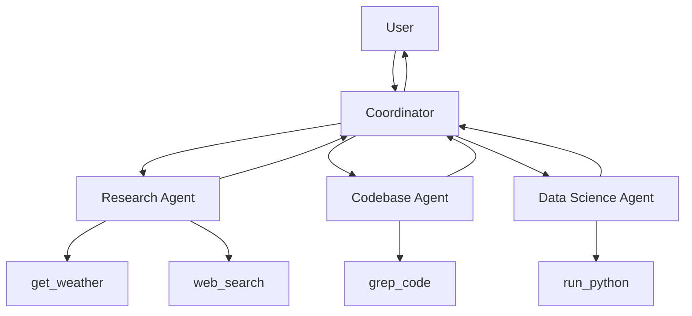
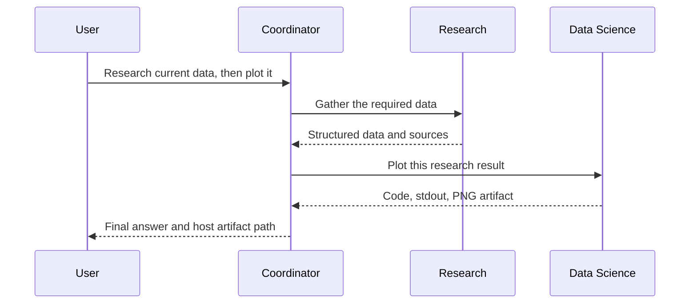
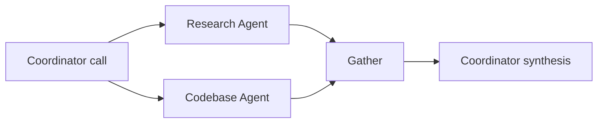

# Multi-agent system

Local Phoenix can visualize and evaluate this hierarchy. See
[EVALUATIONS.md](EVALUATIONS.md) for traces, datasets, experiments,
deterministic route checks, and optional Gemma judging.

## 1. Why decompose the original agent?

The original agent had one prompt and direct access to weather, web search,
repository search, and Python execution. That is easy to begin with, but every
new capability enlarges one model's instructions, permissions, and context.

The multi-agent version separates responsibilities:



The coordinator owns the conversation. Specialists are temporary workers with
smaller prompts and smaller tool permissions.

## 2. Single-agent and multi-agent behavior

In the single-agent design, one model selected every low-level tool and wrote
the answer. In this design:

1. The coordinator decides whether delegation is necessary.
2. It writes a focused task and brief context.
3. A fresh specialist model receives only that delegation.
4. The specialist uses its allowed tools.
5. It returns a structured result.
6. The coordinator combines results into the only user-facing answer.

Specialists do not retain memory between turns. Explicit workflow handoff nodes
may transfer one bounded task over the validated local message protocol; tool
permissions and private transcripts are never transferred.

## 3. Patterns found in maintained projects

### Supervisor or manager

A central agent invokes specialists as tools and keeps control of the final
answer. OpenAI calls this the manager or agents-as-tools pattern. Google ADK
represents a similar hierarchy with a coordinator and `sub_agents`.

This project uses that pattern because one place continues to own public
history, final wording, global limits, and security policy.

### Handoff

A router transfers active task ownership to another agent. The DAG runtime
supports explicit handoff nodes with route, depth, count, payload, correlation,
and acceptance validation. The default return policy sends the result back to
the coordinator, which remains the public speaker.

### Group chat #todo

AutoGen's selector group chat chooses a speaker and broadcasts shared context
to the team. It is useful when agents must debate or respond to each other.
This project avoids broadcasting because specialists need only focused tasks,
and full shared transcripts increase tokens and coupling.

### Sequential workflow

One agent's output becomes another agent's input. The coordinator expresses a
dependency by delegating to one specialist, receiving its result, and issuing
the next delegation in a later coordinator round.

### Parallel fan-out and gather

Independent specialist calls returned together by the coordinator run in a
thread pool. Each worker owns a separate Gemini client. The coordinator waits
for all results and gathers them into one response.

### Generator and critic

One agent generates work and another evaluates it, often inside a bounded
loop. This is documented but omitted from v1 because no current task requires
an extra critic call.

## 4. Agent contracts

### Coordinator

- Sees public session history.
- May answer simple questions directly.
- Can call only `ask_research_agent`, `ask_codebase_agent`, and
  `ask_data_science_agent`.
- May use two delegation rounds and three specialist invocations per turn.
- Produces the final user-facing answer.

### Research Agent

- Receives a focused task and brief context.
- Can call `get_weather` and `web_search`.
- Returns URLs and live-data evidence.
- Has no repository or code-execution access.

### Codebase Agent

- Receives a focused repository question.
- Can call only `grep_code`.
- Returns relative paths, line numbers, and snippets.
- Cannot read secrets, execute code, or search the web.

### Data Science Agent

- Receives a focused calculation or visualization task.
- Can call only `run_python`.
- Returns generated code, stdout, errors, and validated artifacts.
- Python runs inside the existing locked-down Docker sandbox.

## 5. Delegation input

Each coordinator delegation contains:

```json
{
  "task": "Focused work for one specialist",
  "context": "Brief relevant dependency or prior result"
}
```

Each field is capped at 2 KB. Specialists receive neither the full public
conversation nor another specialist's hidden model transcript.

## 6. Structured specialist output

```json
{
  "agent": "codebase_agent",
  "agent_run_id": "uuid",
  "status": "completed",
  "answer": "Concise grounded answer",
  "evidence": [],
  "artifacts": [],
  "tokens": {
    "input": 0,
    "output": 0,
    "thinking": 0,
    "total": 0
  },
  "latency_ms": 0,
  "error": null
}
```

Evidence is capped before entering coordinator context. Internal specialist
events are attached to the trajectory but removed from the result passed back
to the coordinator model.

## 7. Sequential delegation



The second task depends on the first result, so they occupy different
coordinator rounds.

## 8. Parallel delegation



Multiple delegation function calls in one model response assert independence.
They run concurrently with at most three workers. Completion order may differ
from request order, but function responses are returned to Gemini in original
call order.

## 9. Trajectories and DAG relationships

Coordinator model calls have `depth: 0`. Each accepted delegation creates:

1. `delegation_start`, parented by the coordinator model step.
2. Specialist model and tool events at `depth: 1`, parented by the delegation.
3. `delegation_end`, also parented by the delegation.

The combination of `step_id`, `parent_step_id`, timestamps, `agent_name`, and
`agent_run_id` reconstructs sequential paths and parallel fan-out/fan-in.

Turn token totals sum coordinator and specialist model-call usage exactly once.
Parallel specialist latency can sum to more than wall-clock latency because
workers overlap.

## 10. Failure and loop controls

- Provider failures are retried once and returned as structured agent failures.
- One specialist failure does not cancel successful parallel specialists.
- The coordinator must disclose partial results rather than invent evidence.
- One specialist may run only once per user turn; it already has two internal tool rounds.
- A turn may invoke at most three specialists.
- The coordinator has two delegation rounds and one final synthesis call.
- Specialists have two tool rounds and one final synthesis call.
- Specialists cannot delegate, preventing recursive agent loops.

## 11. Sources and design choices

| Source | Pattern studied | Applied here |
|---|---|---|
| [Google ADK Python](https://github.com/google/adk-python) | Coordinator with specialized sub-agents | Hierarchical coordinator and three specialists |
| [Google ADK Samples](https://github.com/google/adk-samples) | Sequential and parallel workflows | Later-round dependencies and same-round fan-out |
| [OpenAI Agents examples](https://openai.github.io/openai-agents-python/examples/) | Routing, agents as tools, parallel execution | Specialists exposed as coordinator tools |
| [OpenAI agent composition](https://openai.github.io/openai-agents-js/guides/agents/) | Manager versus handoff | Manager retained; handoff rejected |
| [Microsoft AutoGen](https://github.com/microsoft/autogen) | Conversable agent teams | Compared for broader multi-agent context |
| [AutoGen SelectorGroupChat](https://microsoft.github.io/autogen/0.4.5/user-guide/agentchat-user-guide/selector-group-chat.html) | Model-selected group-chat speaker | Not used because it broadcasts shared context |

The project remains framework-free so every message, delegation, tool call,
token counter, limit, and parent-child trace remains visible in ordinary
Python.
