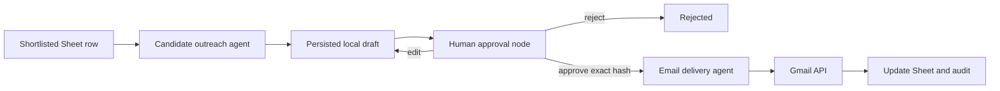

# HITL candidate outreach: complete guide

The outreach system prepares interview invitations for shortlisted candidates,
shows each complete email to a human, and sends only an approved immutable
draft.

## Safety model



The outreach agent has no Gmail authority. The delivery agent cannot create or
edit content. `send_approved_email` reloads the draft from disk and checks its
approval ID, content hash, status, sender, recipient, and previous Gmail ID.
This is a runtime control; model instructions cannot bypass it.

Personalization receives only validated evidence chunks, never raw resume text
or free-form screening summaries. Invalid personalization falls back to the
fixed invitation.

## One-time Google setup

1. Enable Gmail API in Google Cloud project `yoda-498319`.
2. Configure the OAuth consent screen.
3. Add your Gmail account as a test user while the app remains in testing.
4. Keep the existing localhost redirect URI.
5. Put the real client ID and client secret in `.env`; never commit them.
6. Add real company identity:

```dotenv
COMPANY_NAME=Your Company
SENDER_DISPLAY_NAME=Apurv Shukla
SENDER_ROLE=Hiring Team
REPLY_TO_EMAIL=shuklaapurv01@gmail.com
```

Placeholder company values block authorization and sending.

The application requests Gmail's narrow `gmail.send` permission plus the
standard OpenID email identity permission. It cannot read the mailbox, drafts,
contacts, or sent messages.

## Reproducible start commands

```bash
cd /Users/apurv_/Downloads/vibes/agents
python3 -m venv .venv
source .venv/bin/activate
python3 -m pip install -r requirements.txt
cp .env.example .env
# Edit .env with real credentials, resource IDs, and company identity.
python main.py
```

Authorize the sender in the interactive application:

```text
/authorize-email
```

The browser opens Google consent. After consent, a refreshable token is stored
at `data/gmail_token.json` with owner-only file permissions. To change sender,
delete that ignored token file and authorize again.

Useful commands:

```text
/email-auth-status
/screen-resumes
/outreach-status
/outreach-shortlisted
/outreach-shortlisted --resume
```

`--resume` includes previously rejected candidates. `SENT`, `SENDING`, and
`UNKNOWN` candidates remain blocked to prevent accidental duplicate delivery.

## Inner workings

### Candidate selection

The registry reads `Screened_Candidates`. A candidate is eligible only when:

- `status` is `SHORTLISTED`;
- `email` is non-empty;
- outreach is not in a duplicate-risk state.

The workflow does not read rejected candidates' resume text and does not
rescore anyone.

### Draft generation

The fixed template contains the interview invitation, availability request,
and configured signature. The outreach agent may add one sentence grounded in
the stored professional summary/strengths. It cannot mention score, rank,
protected attributes, inferred claims, or another candidate.

A draft contains sender, recipient, reply-to, subject, text body, HTML body,
Sheet row, timestamps, and approval state. Drafts are stored under:

```text
data/outreach_drafts/<draft-id>.json
```

The directory is owner-only and each draft file is mode `0600`.

### Hash and approval

The SHA-256 draft hash covers:

- draft ID
- sender
- recipient
- reply-to
- subject
- plain-text body
- HTML body
- Sheet row

At the terminal, the HITL node prints the complete message:

```text
From: ...
To: ...
Reply-To: ...
Subject: ...

<complete body>

Approve, edit, or reject? [a/e/R]:
```

Approve stores the approval ID, exact draft hash, and time. Reject ends the
candidate branch. Edit replaces the subject/body, regenerates HTML and the
hash, deletes the earlier approval, and invokes a new HITL node.

### Delivery

The delivery boundary reconstructs an RFC-compatible `EmailMessage` with
plain-text and HTML alternatives, then base64URL-encodes it for Gmail.

Immediately before the API call it:

1. Reloads the draft rather than trusting agent arguments.
2. Requires `APPROVED`.
3. Checks approval ID and both stored/current hashes.
4. Rejects invalid recipients and prior Gmail IDs.
5. Verifies the current OAuth identity equals the approved sender.
6. Changes local state to `SENDING`.
7. Calls Gmail once with API retries disabled.

A successful response records `gmail_message_id` and `SENT`.

Gmail does not expose a request idempotency key. A clear 4xx response becomes
`FAILED`; a transport error or 5xx becomes `UNKNOWN`, because Gmail might have
accepted the message before the response was lost. `UNKNOWN` cannot be retried
automatically.

## Sheet migration

The application appends these columns to `Screened_Candidates`:

- `outreach_status`
- `outreach_draft_id`
- `outreach_draft_hash`
- `outreach_subject`
- `approval_id`
- `approved_at`
- `sent_at`
- `gmail_message_id`
- `outreach_error`

Resume rescoring updates only columns A:T, so existing outreach state is
preserved.

Statuses:

- `NOT_PREPARED`
- `PENDING_APPROVAL`
- `EDITED_PENDING_APPROVAL`
- `REJECTED`
- `APPROVED`
- `SENDING`
- `SENT`
- `FAILED`
- `UNKNOWN`

Metadata-only events go to `data/outreach_runs.jsonl`. Full message bodies are
not copied into that log.

## Example transcript

```text
You: /email-auth-status
Email authorized for: recruiter@gmail.com

You: /outreach-shortlisted
--- Outreach approval required ---
From: recruiter@gmail.com
To: candidate@example.com
Subject: Next steps for the Full-Stack AI Engineer opportunity at Example Co

Hi Candidate,
...

Approve, edit, or reject? [a/e/R]: a
Outreach complete: eligible=1 sent=1 rejected=0 failed=0 skipped=0
```

## Recovery

- Missing token: run `/authorize-email`.
- Revoked token: delete `data/gmail_token.json`, then authorize again.
- `FAILED`: use `/outreach-shortlisted --resume`; it creates a fresh approval.
- `UNKNOWN`: inspect the Gmail Sent folder manually. Resolve the Sheet state
  manually before any retry.
- Wrong sender: delete the token and authorize the correct Google account.
- Missing company identity: fill the four company variables in `.env`.

Email outreach is consequential external communication. Review recipient,
claims, tone, and company identity carefully at every approval prompt.

## Long-pending approvals

Pending Sheet state and local drafts do not expire inside the application. If
HR returns after 10–15 days, run `/email-auth-status`, reauthorize if needed,
then run `/outreach-shortlisted` to reload and review the same persisted draft.

External OAuth apps in Testing status commonly have seven-day tester-token
expiry, so Gmail authorization may expire before the draft does. The current
CLI has no background worker or approval inbox; it sends immediately only when
the human approves while the application is running and OAuth is valid.

For the exact behavior with a running terminal, a restarted process, expired
OAuth, approval failure, rejection, and every recovery command, see
[END_TO_END_HIRING_WORKFLOW.md](END_TO_END_HIRING_WORKFLOW.md).
