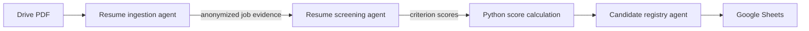

# Resume screening: beginner guide

Run the Full-Stack AI Engineer screening workflow with:

```text
/screen-resumes
```

## Setup

1. Enable Google Drive API and Google Sheets API in the project from
   `keys.json`.
2. Share the Drive folder and spreadsheet with the service account's
   `client_email`.
3. Keep `keys.json` outside Git.
4. Set `RESUME_FOLDER_ID` and `SHEET_ID` in `.env`.
5. Install `requirements.txt`.

A service account is a separate Google identity. Resources shared only with
your personal account are not automatically available to it.

Every PDF first passes prompt-injection analysis. Suspicious files become
`REVIEW_REQUIRED` and are not scored or used for outreach. Run
`/resume-security-review` for a human decision. See
[PROMPT_INJECTION_SECURITY.md](PROMPT_INJECTION_SECURITY.md).

## Job and rubric

**Role:** Full-Stack AI Engineer  
**Preferred minimum experience:** two years  
**Default shortlist threshold:** 70/100

The role covers Python APIs, React/TypeScript interfaces, LLM/RAG/agent
systems, relational and vector storage, Docker/cloud delivery, testing,
security, and observability.

| Criterion | Weight |
|---|---:|
| Relevant professional experience | 20 |
| Python backend and API development | 15 |
| React and TypeScript/JavaScript | 15 |
| LLM integration, RAG, or agents | 20 |
| SQL, data modelling, and vector databases | 10 |
| Docker, cloud, and CI/CD | 10 |
| Testing, security, and observability | 5 |
| Communication, ownership, and delivered projects | 5 |

The seeded `Criteria` tab remains editable. IDs must be unique, weights must be
positive, and the threshold must be between zero and 100.

## Agents and information flow



The ingestion agent retains name, email, and phone for recruiter contact but
separates them from scoring evidence. Name, photo, age, gender, marital status,
address, nationality, religion, disability, and similar attributes are
excluded from the screening prompt.

The screening agent scores only anonymized evidence. Missing evidence scores
zero. The candidate registry agent owns tab initialization and idempotent
writes; it never deletes candidate rows.

## Authoritative score math

Python clamps every criterion to 0–5 and calculates:

```text
contribution = score / 5 × weight × 100 / sum_of_weights
total = sum of contributions
```

Experience ignores the model's proposed score:

- Less than 1 year: 0/5
- 1–1.99 years: 2/5
- 2–2.99 years: 3/5
- 3–4.99 years: 4/5
- 5+ years: 5/5

Two years is not a knockout rule. For example, 2.5 years contributes
`3 / 5 × 20 = 12` points with the default rubric. A total at or above the
threshold becomes `SHORTLISTED`.

## Low-level run flow

1. Authenticate with Drive read-only and Sheets read/write scopes.
2. Create `Criteria` and `Screened_Candidates`; rename an empty `Sheet1`.
3. Seed the predefined rubric only if `Criteria` is empty.
4. Validate criteria and compute a deterministic rubric version.
5. Read existing results by Drive file ID and modified time.
6. List only direct PDF children of the configured folder.
7. Skip unchanged versions and process new/changed PDFs with three workers.
8. Give every worker its own Google API transport.
9. Reject files above 15 MB or 30 pages.
10. Mark encrypted, corrupt, scanned, or nearly empty PDFs `REVIEW_REQUIRED`.
11. Extract evidence, score it, and recalculate the total in Python.
12. Update the existing Drive file row or append a new row.
13. Save privacy-bounded events to `data/resume_screening_runs.jsonl`.

Temporary PDFs are deleted after success or failure.

## Spreadsheet and statuses

`Criteria` contains job settings and the editable rubric.

`Screened_Candidates` contains Drive version fields, candidate contact fields,
experience, score, status, summary, strengths, gaps, criterion/evidence JSON,
rubric/model versions, processing status, and errors.

- `SHORTLISTED`: score meets the threshold.
- `NOT_SHORTLISTED`: completed below threshold.
- `REVIEW_REQUIRED`: PDF extraction is unreliable.
- `ERROR`: API, model, validation, or unexpected failure.

## Repeat runs and failures

The Drive file ID is the stable identity. A matching ID and modified time is
skipped. A changed version updates the same row. One bad resume does not stop
other workers. Google throttling and server errors retry three times, and
Sheet writes happen serially after scoring to avoid row collisions.

Changing the rubric changes `rubric_version` but does not automatically
reprocess unchanged resumes. Clear their `drive_modified_time` cells when a
deliberate full rescore is required.

This ranking assists human review; it should not be the sole basis for a
consequential employment decision. Audit evidence, outcomes, bias, and rubric
quality regularly.
